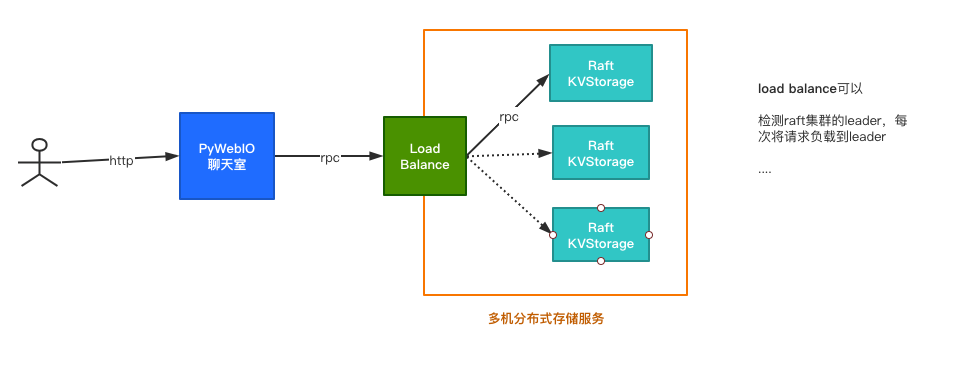

# ChatRoom
一个基于Raft协议的分布式聊天室，聊天记录存储在多台服务器上，通过raft协议确保数据一致性，进行一定的负载均衡和容灾。

## Architecture


## Runing

```bash
git clone https://github.com/FangruiZeng/ChatRoom.git
cd RaftChatRoom
pip3 install -r requirements.txt

# 启动raft集群，需多于两个节点
python3 distributed_list.py -address 127.0.0.1:4321 -partner 127.0.0.1:4322 127.0.0.1:4323 -control_port 8000
python3 distributed_list.py -address 127.0.0.1:4322 -partner 127.0.0.1:4321 127.0.0.1:4323 -control_port 8001
python3 distributed_list.py -address 127.0.0.1:4323 -partner 127.0.0.1:4321 127.0.0.1:4322 -control_port 8002

# 启动聊天室后端，传入集群中某个节点
python3 app.py -raft_addr 127.0.0.1:8000

```

## Features
- 负载均衡，使用在线人数少的节点。
- 容灾，节点崩溃后自动切换到正常节点。
- 用户读数据（聊天记录）通过负载均衡到各个节点读取，写数据（发送聊天消息）统一通过leader节点写（follower节点无权写数据，需RPC到leader）。